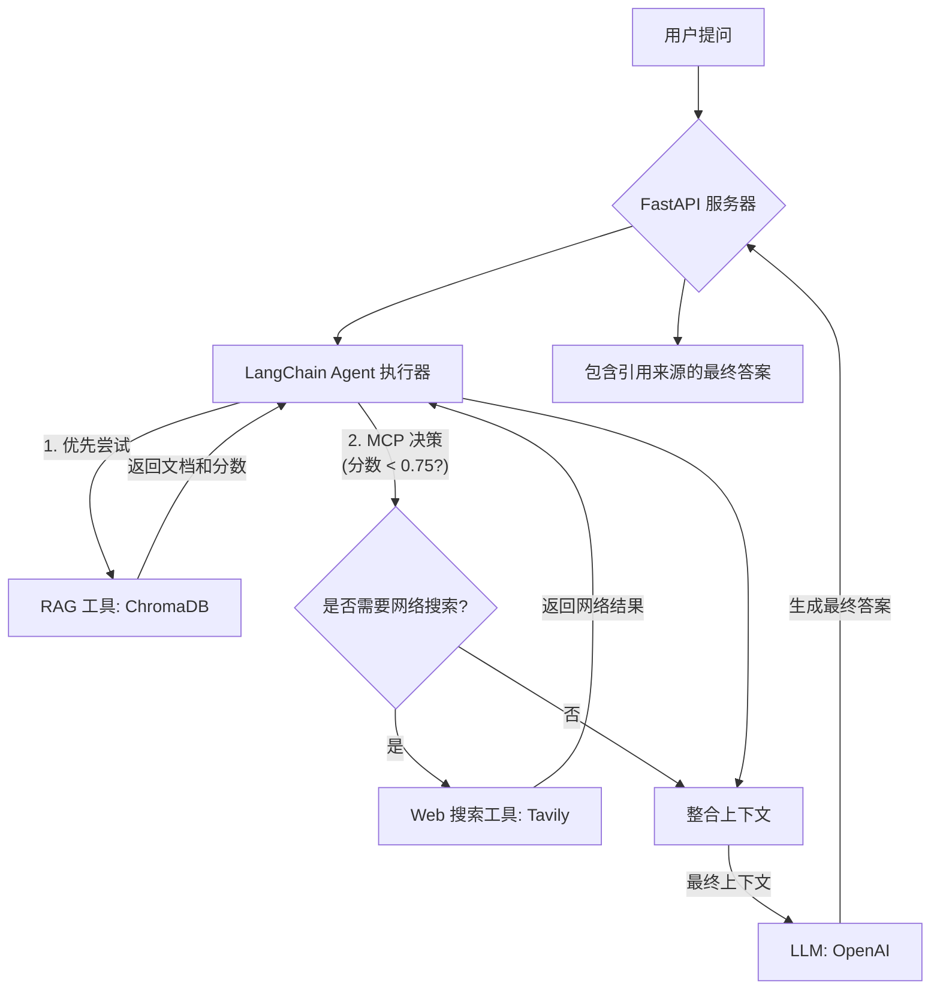

# MCP 驱动的 Agentic RAG 技术文档

本文档旨在详细阐述 MCP 驱动的 Agentic RAG 系统的技术架构、工作流程及核心实现细节。

## 1\. 系统概述

本系统是一个先进的“检索增强生成”（RAG）代理，旨在通过智能地利用多种信息源来精准回答用户提问。它的核心特性是优先查询本地私有知识库，并在判断本地信息不足时，动态地回退到公共网络搜索。

该系统的灵魂是 **MCP (Model Context Protocol - 模型上下文协议)**，这是一套我们定制化设计的规则，用于指导智能体如何寻找、评估和整合信息，以提供最准确、信息来源最清晰的答案。

-----

## 2\. 架构与技术栈

本系统基于一套现代化的、以 Python 为核心的技术栈构建，每个组件都因其在构建 LLM 应用中的独特优势而被选中。

  * **核心编排框架 (Orchestration)**: `LangChain`
  * **大语言模型 (Brain)**: `OpenAI API (GPT-4o / GPT-4-Turbo)`
  * **向量数据库 (本地 RAG)**: `ChromaDB`
  * **网络搜索工具 (Web Search)**: `Tavily Search API`
  * **API 服务器 (API Server)**: `FastAPI`

### 系统流程图



-----

## 3\. MCP (模型上下文协议) 工作流

智能体依照一套明确定义的协议来运作，以保证效率和准确性。

1.  **接收请求**: FastAPI 服务器接收到用户的提问请求。

2.  **初始化 RAG 搜索**: LangChain Agent 立即使用 **RAG 工具**，根据用户提问在本地的 `ChromaDB` 向量数据库中搜索相关文档。

3.  **决策点 (MCP 核心规则)**: Agent 的核心逻辑开始审查从 `ChromaDB` 返回的结果。

      * 它会找出所有返回文档中最高的那个**相似度分数**。
      * 然后应用关键的 MCP 规则：**如果最高相似度分数低于 `0.75`**，系统就判定本地知识不足以回答该问题。

4.  **条件触发式网络搜索**: 一旦 MCP 规则被触发，Agent 将激活**网络搜索工具** (`Tavily`)，从公共互联网上查找相关信息。

5.  **上下文整合**: Agent 收集所有可用的信息：

      * 如果只使用了 RAG，它将使用从 `ChromaDB` 获取的文档。
      * 如果 RAG 和网络搜索都被使用，它会将两个来源的信息整合到一个上下文中。系统提示词会指导 LLM 在信息冲突时，优先采信 `ChromaDB` 的内容。

6.  **生成最终答案**: 经过整合的上下文被传递给大语言模型 (`GPT-4o`)，由其生成一个全面的、最终的答案。

7.  **引用来源**: 最终答案会被格式化，以包含清晰的引用来源，明确指出信息是来自内部知识库还是网络搜索。

-----

## 4\. 核心实现代码片段

以下是概念性的代码示例，展示了如何使用 `LangChain` 实现 MCP 系统的关键部分。

### a. 定义工具 (Tools)

我们将 RAG 和网络搜索功能封装成 Agent 可以使用的 `Tool`。

```python
from langchain.agents import tool
from langchain_community.vectorstores import Chroma
from langchain_community.utilities.tavily_search import TavilySearchAPIWrapper
from langchain.tools.tavily_search import TavilySearchResults

# 假设 'vectorstore' 是一个已经初始化好的 ChromaDB 实例
# 假设 'embedding_function' 是一个已经初始化好的 embedding 模型

@tool
def rag_knowledge_search(query: str) -> str:
    """
    搜索公司私有知识库。
    当用户提问关于内部产品、规格参数和历史数据时，应使用此工具。
    此工具返回文档内容及其元数据。
    """
    # LangChain 的 retriever 返回文档对象，而不仅仅是分数。
    # 我们通常会将核心逻辑包装起来，使其也能返回分数以供 MCP 规则使用。
    # 为了简化，这里只展示获取文档内容的过程。
    # MCP 的判断逻辑（分数比较）会存在于工具之外，在 Agent 的主控制流程中。
    docs_with_scores = vectorstore.similarity_search_with_score(query, k=3)
    return "\n---\n".join([f"来源: {doc.metadata.get('source', 'N/A')}\n内容: {doc.page_content}" for doc, score in docs_with_scores])

# 网络搜索工具
search_wrapper = TavilySearchAPIWrapper()
tavily_tool = TavilySearchResults(api_wrapper=search_wrapper)

# 为 Agent 提供工具列表
tools = [rag_knowledge_search, tavily_tool]
```

### b. 系统提示词 (System Prompt)

一个精心设计的系统提示词，用于指导 Agent 如何根据 MCP 协议工作。

```python
SYSTEM_PROMPT = """
你是一个严谨、乐于助人的研究助理。

你的目标是利用你所拥有的工具，来精准地回答用户的问题。

你必须严格遵守以下的 MCP (模型上下文协议):
1. 对于每一个用户提问，你 **必须** 首先使用 `rag_knowledge_search` 工具。
2. 在从 `rag_knowledge_search` 工具获取结果后，如果你判断这些信息不足以或不相关，无法完整回答问题时，你才被允许使用 `tavily_tool` 工具去搜索网络。
3. 在提供最终答案时，请使用格式 [来源: ...] 来清晰地注明你的信息来源。
4. 如果来自知识库和网络的信息发生冲突，请明确指出冲突点，并优先采信知识库中的信息。
5. 将所有来源的信息整合成一个连贯的、统一的答案。
"""
```

### c. Agent 初始化 (概念)

展示如何将工具和提示词组合在一起，创建出我们的 Agent。

```python
from langchain_openai import ChatOpenAI
from langchain.agents import create_tool_calling_agent, AgentExecutor
from langchain_core.prompts import ChatPromptTemplate

# 初始化 LLM
llm = ChatOpenAI(model="gpt-4o", temperature=0)

# 创建 Prompt 模板
prompt = ChatPromptTemplate.from_messages([
    ("system", SYSTEM_PROMPT),
    ("human", "{input}"),
    ("placeholder", "{agent_scratchpad}"),
])


# 创建 Agent
# 实际的 MCP 逻辑 (if score < 0.75) 通常会作为 Agent 外围的自定义控制流来实现，
# 而不仅仅是依赖于 Prompt 的引导。
agent = create_tool_calling_agent(llm, tools, prompt)
agent_executor = AgentExecutor(agent=agent, tools=tools, verbose=True)

# 调用示例
# response = agent_executor.invoke({"input": "我们公司第一季度的营收是多少？"})
# print(response)
```

-----

## 5\. 环境设置与安装

### a. 依赖库

```text
# requirements.txt
langchain
langchain-openai
langchain-community
fastapi
uvicorn
python-dotenv
chromadb
tavily-python
# 如果使用 FAISS，还需要
# faiss-cpu or faiss-gpu
```

### b. 环境变量

在项目根目录下创建一个 `.env` 文件，用于存放你的 API 密钥。

```env
# .env
OPENAI_API_KEY="sk-..."
TAVILY_API_KEY="tvly-..."
```