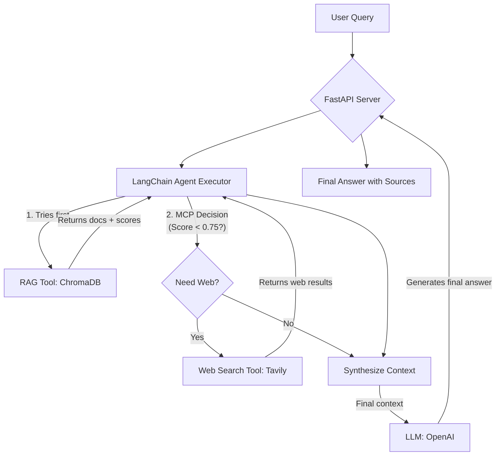

# MCP-Powered Agentic RAG: Technical Documentation

This document outlines the technical architecture, workflow, and implementation details for the MCP-powered Agentic RAG system.

## 1\. Overview

This system is an advanced Retrieval-Augmented Generation (RAG) agent designed to answer user queries by intelligently leveraging multiple information sources. It prioritizes a local, private knowledge base and dynamically falls back to a public web search if the local information is deemed insufficient.

The core of this system is the **MCP (Model Context Protocol)**, a custom-designed set of rules that governs how the agent seeks, evaluates, and synthesizes information to provide accurate, well-sourced answers.

-----

## 2\. Architecture & Tech Stack

The system is built on a modern, Python-based stack, with each component chosen for its specific strengths in building LLM-powered applications.

  * **Core Orchestration**: `LangChain`
  * **LLM (Brain)**: `OpenAI API (GPT-4o / GPT-4-Turbo)`
  * **Vector Database (Local RAG)**: `ChromaDB`
  * **Web Search Tool**: `Tavily Search API`
  * **API Server**: `FastAPI`

### System Flow Diagram



-----

## 3\. The MCP (Model Context Protocol) Workflow

The agent operates on a clearly defined protocol to ensure efficiency and accuracy.

1.  **Query Reception**: The FastAPI server receives a user query.

2.  **Initial RAG Search**: The LangChain agent immediately uses the **RAG Tool** to search the local `ChromaDB` vector store for relevant documents based on the user's query.

3.  **Decision Point (MCP Rule)**: The agent's core logic inspects the results from `ChromaDB`.

      * It identifies the highest similarity score among the retrieved documents.
      * It applies the key MCP rule: **If the highest similarity score is less than `0.75`**, it determines that the local knowledge is insufficient.

4.  **Conditional Web Search**: If the MCP rule is triggered, the agent then activates the **Web Search Tool** (`Tavily`) to find relevant information from the public internet.

5.  **Context Synthesis**: The agent gathers all available information:

      * If only RAG was used, it uses the documents from `ChromaDB`.
      * If both RAG and Web Search were used, it combines the information from both sources into a single context. The system prompt instructs the LLM to prioritize the `ChromaDB` source in case of contradictions.

6.  **Final Answer Generation**: The synthesized context is passed to the LLM (`GPT-4o`), which generates a final, comprehensive answer.

7.  **Source Citation**: The final answer is formatted to include citations, clearly indicating whether the information came from the internal knowledge base or a web source.

-----

## 4\. Implementation Snippets

Below are conceptual code examples demonstrating how to implement the key parts of the MCP system using `LangChain`.

### a. Defining Tools

The RAG and Web Search functionalities are wrapped as `Tools` for the agent to use.

```python
from langchain.agents import tool
from langchain_community.vectorstores import Chroma
from langchain_community.utilities.tavily_search import TavilySearchAPIWrapper

# Assume 'vectorstore' is an initialized ChromaDB instance
# Assume 'embedding_function' is an initialized embedding model

@tool
def rag_knowledge_search(query: str) -> str:
    """
    Searches the private company knowledge base.
    Use this for questions about internal products, specs, and historical data.
    Returns documents and their scores.
    """
    # LangChain's retriever returns documents, not just scores.
    # We'd typically wrap the core logic to also return scores for our MCP rule.
    docs = vectorstore.similarity_search_with_score(query, k=3)
    # For simplicity, we'll just show the document content retrieval here.
    # The MCP logic would live outside the tool itself, in the agent's control loop.
    return "\n---\n".join([f"Source: {doc.metadata.get('source', 'N/A')}\nContent: {doc.page_content}" for doc, score in docs])

# Web Search Tool
search = TavilySearchAPIWrapper()
tavily_tool = TavilySearchResults(api_wrapper=search)

tools = [rag_knowledge_search, tavily_tool]
```

### b. System Prompt

A carefully crafted system prompt instructs the agent on how to behave according to the MCP.

```python
SYSTEM_PROMPT = """
You are a helpful and precise research assistant.

Your goal is to answer user questions accurately by using the tools at your disposal.

You must follow the MCP (Model Context Protocol):
1.  You **MUST** use the `rag_knowledge_search` tool first for every user query.
2.  After getting the results from `rag_knowledge_search`, if you judge the information to be insufficient or irrelevant to fully answer the question, you may then use the `tavily_tool` to search the web.
3.  When providing your final answer, cite your sources clearly using the format [Source: ...].
4.  If information from the knowledge base and the web conflicts, state the conflict and prioritize the information from the knowledge base.
5.  Synthesize the information from all sources into a single, coherent answer.
"""
```

### c. Agent Initialization (Conceptual)

This shows how the tools and prompt come together to create the agent.

```python
from langchain_openai import ChatOpenAI
from langchain.agents import create_tool_calling_agent, AgentExecutor

# Initialize the LLM
llm = ChatOpenAI(model="gpt-4o", temperature=0)

# Create the agent
# The actual MCP logic (if score < 0.75) is often implemented
# as a custom control loop around the agent, not just in the prompt.
agent = create_tool_calling_agent(llm, tools, SYSTEM_PROMPT)
agent_executor = AgentExecutor(agent=agent, tools=tools, verbose=True)

# Example invocation
# response = agent_executor.invoke({"input": "What was our Q1 revenue?"})
# print(response)
```

-----

## 5\. Setup & Installation

### a. Requirements

```text
# requirements.txt
langchain
langchain-openai
langchain-community
fastapi
uvicorn
python-dotenv
chromadb
tavily-python
```

### b. Environment Variables

Create a `.env` file in the root directory to store your API keys.

```env
# .env
OPENAI_API_KEY="sk-..."
TAVILY_API_KEY="tvly-..."
```