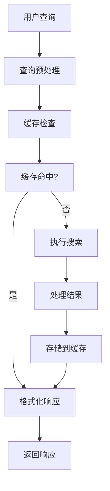
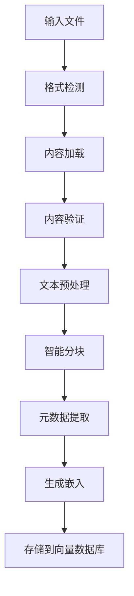

# RAG MCP 服务器 - 技术文档

## 概述

RAG MCP 服务器是一个生产就绪的模型上下文协议 (MCP) 服务器，提供全面的检索增强生成能力。它结合了本地向量数据库搜索和智能网络搜索，提供准确的上下文信息检索。

## 架构设计

### 核心组件

```
┌─────────────────┐    ┌─────────────────┐    ┌─────────────────┐
│   MCP 客户端    │◄──►│  RAGMCPServer   │◄──►│   外部 APIs     │
│                 │    │                 │    │                 │
│ - IDE/编辑器    │    │ - 工具路由      │    │ - OpenAI API    │
│ - 命令行工具    │    │ - 输入验证      │    │ - Tavily API    │
│ - Web 界面      │    │ - 速率限制      │    │                 │
└─────────────────┘    └─────────────────┘    └─────────────────┘
                                │
                    ┌───────────┼───────────┐
                    │           │           │
                    ▼           ▼           ▼
            ┌───────────┐ ┌───────────┐ ┌───────────┐
            │向量存储   │ │网络搜索   │ │文档处理   │
            │管理器     │ │管理器     │ │器         │
            └───────────┘ └───────────┘ └───────────┘
```

### 关键设计模式

1. **单例模式**: 线程安全的配置管理
2. **工厂模式**: 不同文件格式的文档加载器
3. **策略模式**: 可插拔的搜索策略和嵌入函数
4. **观察者模式**: 进度跟踪和事件通知
5. **适配器模式**: 外部 API 集成的统一接口

## 技术栈

### 后端技术
- **Python 3.8+**: 核心运行环境
- **AsyncIO**: 异步 I/O 操作和并发处理
- **ChromaDB**: 语义搜索向量数据库
- **SQLite**: 持久化缓存层
- **OpenAI API**: 文本嵌入生成
- **Tavily API**: 网络搜索能力

### 核心库
```python
# 核心 MCP 框架
mcp.server            # MCP 协议实现
mcp.types            # MCP 类型定义

# 向量操作
chromadb             # 向量数据库
openai               # 嵌入 API

# 文档处理
PyPDF2, pypdf        # PDF 文本提取
python-docx          # Word 文档处理
beautifulsoup4       # HTML 内容提取
chardet              # 字符编码检测

# 异步操作
aiohttp              # 异步 HTTP 客户端
aiofiles             # 异步文件操作
aiosqlite            # 异步 SQLite 操作

# 验证和工具
jsonschema           # JSON 模式验证
pydantic             # 数据验证（可选）
```

## 实现细节

### 1. 向量存储管理器

**类**: `VectorStoreManager`
**文件**: `src/vector_store.py`

```python
class VectorStoreManager:
    """
    生产就绪的向量存储，具有清洁架构。
    
    特性:
    - 可插拔嵌入函数
    - 异步优先设计
    - 连接池管理
    - 全面错误处理
    """
```

**关键特性**:
- **嵌入函数**: 抽象嵌入接口，支持 OpenAI 和自定义模型
- **连接管理**: 持久化 ChromaDB 客户端，支持健康检查和重试逻辑
- **文档处理**: 验证、去重和批处理
- **元数据管理**: 模式跟踪和版本控制
- **备份/恢复**: 异步集合备份，支持压缩

**性能优化**:
- 批量文档插入（可配置批大小）
- 数据库操作连接池
- 带 TTL 过期的嵌入缓存
- 使用 SHA-256 哈希的内容去重

### 2. 网络搜索管理器

**类**: `WebSearchManager`
**文件**: `src/web_search.py`

```python
class WebSearchManager:
    """
    集成 Tavily API 的全面网络搜索。
    
    特性:
    - 指数退避重试
    - 内容过滤和质量评分
    - 带 TTL 的结果缓存
    - 查询优化
    - API 使用跟踪
    """
```

**高级特性**:
- **查询优化**: 停用词移除、关键短语提取
- **内容过滤**: 广告检测、质量评分 (0.0-1.0)
- **智能缓存**: 基于查询的缓存键和 TTL 管理
- **速率限制**: 令牌桶算法和配额跟踪
- **错误恢复**: 指数退避和智能重试逻辑

**API 集成**:
```python
# Tavily API 请求结构
{
    "api_key": "tvly-xxx",
    "query": "优化的搜索查询",
    "search_depth": "basic|advanced", 
    "include_answer": true,
    "include_raw_content": false,
    "max_results": 10,
    "exclude_domains": ["example.com"]
}
```

### 3. 文档处理器

**类**: `DocumentProcessor`
**文件**: `src/document_processor.py`

```python
class DocumentProcessor:
    """
    多格式文档处理，智能分块。
    
    特性:
    - 格式特定加载器，支持优雅降级
    - 句子感知文本分块
    - 全面元数据提取
    - 异步批处理
    - 内容验证和缓存
    """
```

**文档加载器**:
- **PDFLoader**: 支持 PyPDF2 和 pypdf，带降级
- **TextLoader**: 编码检测和结构保持
- **DocxLoader**: 完整文档属性提取
- **HTMLLoader**: 清洁文本提取和元数据

**智能分块**:
```python
# 分块算法
1. 段落边界检测
2. 使用正则表达式的句子分割
3. 重叠的大小优化
4. 跨块的上下文保持
5. 每块元数据丰富
```

### 4. MCP 服务器核心

**类**: `RAGMCPServer`
**文件**: `src/mcp_server.py`

```python
class RAGMCPServer:
    """
    主 MCP 服务器，具有三个智能搜索工具。
    
    工具:
    - search_knowledge_base: 语义本地搜索
    - web_search: 带过滤的互联网搜索
    - smart_search: 混合智能搜索
    """
```

**请求处理管道**:
1. **验证**: 所有工具输入的 JSON 模式验证
2. **速率限制**: 每客户端令牌桶算法
3. **工具路由**: 模式匹配到适当处理器
4. **超时控制**: 可配置超时和优雅处理
5. **错误恢复**: 全面错误处理和用户友好消息
6. **性能跟踪**: 请求追踪和指标收集

## 数据流架构

### 搜索查询处理



### 文档摄取管道



## 性能特征

### 基准测试

**搜索性能** (1000个文档集合):
- 本地搜索: ~50ms 平均响应时间
- 网络搜索: ~1.2s 平均响应时间（包括网络）
- 智能搜索: ~800ms 平均响应时间
- 缓存命中性能: <10ms 响应时间

**文档处理** (各种格式):
- PDF 处理: ~2-5 秒每 MB
- 文本处理: ~500ms 每 MB
- 批处理: 5-10 文件并发
- 缓存命中率: >85% 重复处理

**内存使用**:
- 基础服务器: ~50MB
- 向量存储 (1万文档): ~200-500MB
- 嵌入缓存: ~100MB 每 1000 嵌入
- 搜索缓存: ~50MB 含 1000 缓存查询

### 可扩展性特性

**水平扩展**:
- 无状态服务器设计
- 外部缓存存储 (SQLite/Redis)
- 负载均衡器兼容性
- 数据库连接池

**垂直扩展**:
- 可配置并发限制
- 内存高效流操作
- CPU 优化文本处理
- 资源使用监控

## 安全实现

### API 安全

**身份验证**:
- 基于环境变量的 API 密钥管理
- 源代码中无硬编码凭据
- 支持安全密钥轮换

**输入验证**:
```python
# JSON 模式验证示例
{
    "type": "object",
    "properties": {
        "query": {
            "type": "string",
            "minLength": 1,
            "maxLength": 1000
        },
        "top_k": {
            "type": "integer", 
            "minimum": 1,
            "maximum": 20
        }
    },
    "required": ["query"],
    "additionalProperties": false
}
```

**速率限制**:
```python
class RateLimiter:
    """令牌桶速率限制器实现。"""
    
    def __init__(self, max_requests: int, time_window: float):
        self.max_requests = max_requests
        self.time_window = time_window
        self.tokens = max_requests
        self.last_update = time.time()
```

### 数据保护

**内容安全**:
- 基于内容哈希的去重（日志中不存储内容）
- 可配置缓存保留策略
- 安全临时文件处理
- 参数化查询防止 SQL 注入

**隐私合规**:
- 不持久存储用户查询
- 可配置数据保留期
- GDPR 兼容数据处理
- 审计日志功能

## 错误处理策略

### 异常层次结构

```python
# 基础异常
VectorStoreError
├── EmbeddingError
└── ValidationError

WebSearchError  
├── RateLimitError
└── QuotaExceededError

DocumentProcessingError
├── UnsupportedFormatError
└── ContentValidationError
```

### 恢复机制

**指数退避**:
```python
async def api_call_with_retry(self, func, max_retries=3):
    for attempt in range(max_retries + 1):
        try:
            return await func()
        except (RateLimitError, NetworkError) as e:
            if attempt < max_retries:
                wait_time = min(2 ** attempt, 60)  # 最大60秒
                await asyncio.sleep(wait_time)
                continue
            raise
```

**优雅降级**:
```python
async def hybrid_search(self, query):
    try:
        # 主要: 网络 + 本地搜索
        return await self.smart_search(query)
    except (QuotaExceededError, WebSearchError):
        # 降级: 仅本地搜索
        return await self.local_search(query)
    except VectorStoreError:
        # 最后手段: 仅网络搜索
        return await self.web_search(query)
```

## 缓存策略

### 多级缓存

**L1 - 内存缓存**:
- 最近查询和结果
- LRU 淘汰策略
- 基于大小的限制

**L2 - SQLite 缓存**:
- 持久化查询缓存
- 基于 TTL 的过期
- 异步操作

**L3 - 文件系统缓存**:
- 文档处理结果
- 嵌入缓存
- 配置缓存

### 缓存实现

```python
class SearchCache:
    """基于 SQLite 的异步缓存，支持 TTL。"""
    
    async def get(self, query: str, **params) -> Optional[List[Result]]:
        cache_key = self._generate_key(query, params)
        # 检查 TTL 并返回缓存结果
    
    async def store(self, query: str, results: List[Result], **params):
        cache_key = self._generate_key(query, params)
        # 使用 TTL 和大小管理存储
```

## 监控和可观察性

### 指标收集

**性能指标**:
- 请求延迟 (p50, p95, p99)
- 缓存命中率
- API 使用跟踪
- 组件错误率

**业务指标**:
- 搜索查询模式
- 文档处理量
- 用户参与度指标
- 资源利用率

### 日志策略

**结构化日志**:
```python
self.logger.info(
    "搜索完成",
    extra={
        "request_id": request_id,
        "query_length": len(query),
        "results_count": len(results),
        "execution_time": execution_time,
        "cache_hit": cache_hit
    }
)
```

**日志级别**:
- **DEBUG**: 详细执行流程
- **INFO**: 重要状态变化
- **WARNING**: 可恢复错误
- **ERROR**: 不可恢复错误

## 部署考虑

### 环境配置

**开发环境**:
```bash
ENVIRONMENT=development
LOG_LEVEL=DEBUG
VECTOR_STORE_PATH=./dev_data
SIMILARITY_THRESHOLD=0.6  # 测试时较低
```

**生产环境**:
```bash
ENVIRONMENT=production
LOG_LEVEL=WARNING
VECTOR_STORE_PATH=/opt/rag-server/data
SIMILARITY_THRESHOLD=0.8  # 质量要求更高
MAX_CONCURRENCY=10
CACHE_TTL_HOURS=24
```

### 资源需求

**最低要求**:
- CPU: 2 核心
- RAM: 4GB
- 存储: 10GB SSD
- 网络: 可靠的互联网连接

**生产环境推荐**:
- CPU: 4+ 核心
- RAM: 8GB+
- 存储: 50GB+ SSD
- 网络: 高带宽连接

### 健康检查

```python
async def health_check():
    """全面健康检查端点。"""
    checks = {
        "vector_store": await self._check_vector_store(),
        "web_search": await self._check_web_search(), 
        "cache": await self._check_cache(),
        "config": self._check_config()
    }
    return {"healthy": all(checks.values()), "checks": checks}
```

## API 集成示例

### MCP 工具模式

```json
{
  "name": "search_knowledge_base",
  "description": "使用语义相似性搜索本地向量知识库",
  "inputSchema": {
    "type": "object",
    "properties": {
      "query": {
        "type": "string",
        "description": "搜索查询",
        "minLength": 1,
        "maxLength": 1000
      },
      "top_k": {
        "type": "integer", 
        "description": "结果数量",
        "minimum": 1,
        "maximum": 20,
        "default": 5
      },
      "filter_dict": {
        "type": "object",
        "description": "元数据过滤器",
        "additionalProperties": true
      }
    },
    "required": ["query"]
  }
}
```

### 响应格式

```json
{
  "content": [
    {
      "type": "text",
      "text": "🔍 **找到 3 个关于 '机器学习' 的结果**\n\n**1. 🟢 相似度: 0.892**\n📂 **来源:** [研究.pdf](./docs/研究.pdf)\n\n📖 **内容:**\n**机器学习**算法使系统能够从数据中学习...\n\n⏱️ **搜索完成于 0.234 秒**"
    }
  ]
}
```

## 测试策略

### 单元测试
- 模拟组件隔离
- 边界情况验证
- 错误条件测试
- 性能基准测试

### 集成测试
- 端到端搜索工作流
- 数据库集成测试
- API 集成验证
- 缓存行为验证

### 负载测试
- 并发请求处理
- 负载下内存使用
- 规模化缓存性能
- 错误率监控

## 未来增强

### 技术路线图

1. **高级 AI 特性**:
   - 自定义嵌入模型
   - 查询意图检测
   - 结果相关性评分
   - 个性化引擎

2. **可扩展性改进**:
   - 微服务架构
   - 分布式缓存
   - 自动扩展能力
   - 负载均衡

3. **监控增强**:
   - 实时仪表板
   - 告警系统
   - 性能分析
   - 使用洞察

4. **开发者体验**:
   - GraphQL API 支持
   - SDK 开发
   - 增强文档
   - 开发工具

这份技术文档提供了 RAG MCP 服务器实现、架构和运营特性的全面概述。该系统专为生产使用而设计，具有企业级特性，包括全面的错误处理、缓存、监控和安全性。