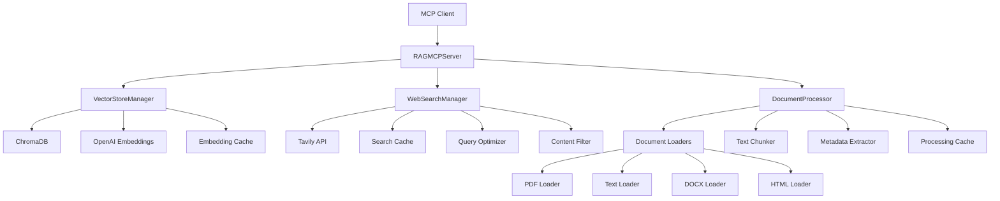

# Architecture Overview

This document provides a comprehensive overview of the RAG MCP Server architecture, including component relationships, data flow, and design patterns.

## System Architecture

### High-Level Architecture

```
┌─────────────────┐    ┌─────────────────┐    ┌─────────────────┐
│   MCP Client    │◄──►│  RAGMCPServer   │◄──►│  External APIs  │
│                 │    │                 │    │                 │
│ - IDE/Editor    │    │ - Tool Routing  │    │ - OpenAI API    │
│ - CLI Tool      │    │ - Validation    │    │ - Tavily API    │
│ - Web Interface │    │ - Rate Limiting │    │                 │
└─────────────────┘    └─────────────────┘    └─────────────────┘
                                │
                    ┌───────────┼───────────┐
                    │           │           │
                    ▼           ▼           ▼
            ┌───────────┐ ┌───────────┐ ┌───────────┐
            │VectorStore│ │WebSearch  │ │Document   │
            │Manager    │ │Manager    │ │Processor  │
            │           │ │           │ │           │
            │- ChromaDB │ │- Tavily   │ │- Multi-   │
            │- Embeddings│ │- Caching  │ │  Format   │
            │- Search   │ │- Filtering│ │- Chunking │
            └───────────┘ └───────────┘ └───────────┘
                    │           │           │
                    ▼           ▼           ▼
            ┌───────────┐ ┌───────────┐ ┌───────────┐
            │ Storage   │ │ Cache     │ │ File      │
            │ Layer     │ │ Layer     │ │ System    │
            │           │ │           │ │           │
            │- ChromaDB │ │- SQLite   │ │- Local    │
            │- File     │ │- Memory   │ │- Network  │
            │  System   │ │- TTL      │ │- Cloud    │
            └───────────┘ └───────────┘ └───────────┘
```

### Component Relationships



## Design Patterns

### 1. Singleton Pattern

**Used in:** Configuration management

```python
class Config:
    _instance: Optional['Config'] = None
    _initialized: bool = False
    
    def __new__(cls) -> 'Config':
        if cls._instance is None:
            cls._instance = super().__new__(cls)
        return cls._instance
```

**Benefits:**
- Ensures single configuration instance across the application
- Provides global access point for configuration
- Prevents configuration conflicts

### 2. Factory Pattern

**Used in:** Document loaders, embedding functions

```python
class DocumentLoaderFactory:
    @staticmethod
    def create_loader(file_path: Path) -> DocumentLoader:
        extension = file_path.suffix.lower()
        if extension == '.pdf':
            return PDFLoader()
        elif extension in ['.txt', '.md']:
            return TextLoader()
        # ... other loaders
```

**Benefits:**
- Encapsulates object creation logic
- Easy to extend with new document types
- Maintains loose coupling between components

### 3. Strategy Pattern

**Used in:** Search strategies, chunking strategies

```python
class SearchStrategy(ABC):
    @abstractmethod
    async def search(self, query: str) -> List[SearchResult]:
        pass

class LocalSearchStrategy(SearchStrategy):
    async def search(self, query: str) -> List[SearchResult]:
        # Local search implementation
        
class WebSearchStrategy(SearchStrategy):
    async def search(self, query: str) -> List[SearchResult]:
        # Web search implementation
```

**Benefits:**
- Allows runtime algorithm selection
- Makes strategies interchangeable
- Simplifies testing and maintenance

### 4. Observer Pattern

**Used in:** Progress tracking, event handling

```python
class ProgressCallback(Protocol):
    def __call__(self, current: int, total: int, status: str = "") -> None: ...

# Usage in document processing
await processor.process_files(
    files,
    progress_callback=lambda current, total, status: print(f"{current}/{total}: {status}")
)
```

**Benefits:**
- Decouples progress reporting from business logic
- Allows multiple observers
- Provides flexible notification system

### 5. Adapter Pattern

**Used in:** API integrations, data format conversions

```python
class TavilyAdapter:
    def __init__(self, api_client):
        self.client = api_client
    
    async def search(self, query: str) -> List[WebSearchResult]:
        # Adapt Tavily API response to internal format
        raw_results = await self.client.search(query)
        return [self._convert_result(r) for r in raw_results]
```

**Benefits:**
- Isolates external API dependencies
- Provides consistent internal interfaces
- Simplifies API migration and testing

## Data Flow

### 1. Knowledge Base Search Flow

```
User Query
    │
    ▼
Query Preprocessing
    │ (lowercase, special chars, keywords)
    ▼
Vector Store Search
    │ (similarity search with embeddings)
    ▼
Result Sorting
    │ (by score and timestamp)
    ▼
Content Highlighting
    │ (keyword highlighting)
    ▼
Response Formatting
    │ (metadata, scores, sources)
    ▼
Formatted Results
```

### 2. Web Search Flow

```
User Query
    │
    ▼
Cache Check ──► Cache Hit ──► Return Cached Results
    │                              │
    ▼ Cache Miss                   ▼
Query Optimization         Response Formatting
    │ (stop words, key phrases)    │
    ▼                              │
API Request with Retry            │
    │ (exponential backoff)        │
    ▼                              │
Content Filtering                 │
    │ (ad removal, quality check)  │
    ▼                              │
Result Caching ───────────────────┘
    │
    ▼
Formatted Results
```

### 3. Document Processing Flow

```
Input Files
    │
    ▼
Format Detection
    │
    ▼
Cache Check ──► Cache Hit ──► Return Cached Results
    │                              │
    ▼ Cache Miss                   │
Content Extraction                │
    │ (format-specific loaders)    │
    ▼                              │
Content Validation               │
    │ (length, quality checks)     │
    ▼                              │
Text Preprocessing               │
    │ (normalization, cleaning)    │
    ▼                              │
Intelligent Chunking             │
    │ (sentence boundaries)        │
    ▼                              │
Metadata Extraction              │
    │ (file info, content hash)    │
    ▼                              │
Result Caching ──────────────────┘
    │
    ▼
Processed Documents
```

## Component Details

### RAGMCPServer

**Responsibilities:**
- MCP protocol handling
- Tool routing and validation
- Request/response transformation
- Rate limiting and metrics
- Error handling and logging

**Key Features:**
- JSON Schema validation for all tool inputs
- Request tracing with unique IDs
- Performance metrics collection
- Graceful error handling with user-friendly messages
- Comprehensive logging for debugging

### VectorStoreManager

**Responsibilities:**
- Vector database operations
- Document embeddings management
- Similarity search execution
- Collection backup and restore
- Performance monitoring

**Architecture:**
```
VectorStoreManager
├── EmbeddingFunction (OpenAI)
├── DocumentProcessor (validation)
├── MetadataManager (schema)
├── CacheManager (embeddings)
└── ChromaDB Client
```

**Key Features:**
- Pluggable embedding functions
- Async-first design
- Connection pooling and health checks
- Comprehensive error handling
- Deduplication and validation

### WebSearchManager

**Responsibilities:**
- Web search API integration
- Query optimization
- Content filtering and quality assessment
- Result caching
- API quota management

**Architecture:**
```
WebSearchManager
├── QueryOptimizer (preprocessing)
├── ContentFilter (ad removal)
├── UsageTracker (quotas)
├── SearchCache (TTL cache)
└── HTTP Client (Tavily API)
```

**Key Features:**
- Exponential backoff retry
- Smart content filtering
- Query optimization
- Usage tracking
- Comprehensive caching

### DocumentProcessor

**Responsibilities:**
- Multi-format document loading
- Intelligent text chunking
- Metadata extraction
- Batch processing with concurrency control
- Processing cache management

**Architecture:**
```
DocumentProcessor
├── DocumentLoaders
│   ├── PDFLoader
│   ├── TextLoader
│   ├── DocxLoader
│   └── HTMLLoader
├── TextChunker
├── MetadataExtractor
├── TextPreprocessor
└── ProcessingCache
```

**Key Features:**
- Format-specific loaders with graceful degradation
- Sentence-aware chunking
- Comprehensive metadata extraction
- Async batch processing
- Progress tracking

## Error Handling Strategy

### Error Hierarchy

```
Exception
├── VectorStoreError
│   ├── EmbeddingError
│   └── ValidationError
├── WebSearchError
│   ├── RateLimitError
│   └── QuotaExceededError
├── DocumentProcessingError
│   ├── UnsupportedFormatError
│   └── ContentValidationError
└── ConfigurationError
```

### Error Handling Principles

1. **Fail Fast**: Validate inputs early and fail with clear messages
2. **Graceful Degradation**: Provide fallbacks when possible
3. **User-Friendly Messages**: Transform technical errors into actionable feedback
4. **Comprehensive Logging**: Log errors with context for debugging
5. **Recovery Mechanisms**: Implement retry logic with backoff

### Error Recovery Patterns

```python
# Retry with exponential backoff
async def api_call_with_retry(self, func, max_retries=3):
    for attempt in range(max_retries + 1):
        try:
            return await func()
        except (RateLimitError, NetworkError) as e:
            if attempt < max_retries:
                wait_time = 2 ** attempt
                await asyncio.sleep(wait_time)
                continue
            raise

# Graceful degradation
async def hybrid_search(self, query):
    try:
        # Try web search first
        return await self.web_search(query)
    except (QuotaExceededError, WebSearchError):
        # Fallback to local search
        return await self.local_search(query)
```

## Performance Optimizations

### 1. Caching Strategy

**Multi-Level Caching:**
- **L1 - Memory Cache**: Fast access for recent queries
- **L2 - SQLite Cache**: Persistent cache with TTL
- **L3 - File System Cache**: Document processing results

**Cache Keys:**
- Content-based hashing for deduplication
- Query parameter inclusion for accuracy
- TTL-based expiration for freshness

### 2. Async/Await Patterns

**Concurrent Processing:**
```python
# Parallel document processing
tasks = [process_file(file) for file in files]
results = await asyncio.gather(*tasks, return_exceptions=True)

# Concurrent search operations
local_task = asyncio.create_task(local_search(query))
web_task = asyncio.create_task(web_search(query))
local_results, web_results = await asyncio.gather(local_task, web_task)
```

**Benefits:**
- Improved throughput for I/O operations
- Better resource utilization
- Responsive user experience

### 3. Connection Pooling

**Database Connections:**
```python
class CacheManager:
    def __init__(self, pool_size: int = 5):
        self._connection_pool: asyncio.Queue = asyncio.Queue(maxsize=pool_size)
    
    @asynccontextmanager
    async def _get_connection(self):
        conn = await self._connection_pool.get()
        try:
            yield conn
        finally:
            await self._connection_pool.put(conn)
```

**Benefits:**
- Reduced connection overhead
- Better resource management
- Improved scalability

### 4. Batch Processing

**Document Processing:**
- Process multiple documents concurrently
- Configurable batch sizes
- Progress tracking and early termination

**Vector Operations:**
- Batch embedding generation
- Bulk database insertions
- Efficient memory usage

## Security Considerations

### 1. API Key Management

- Environment variable storage
- No hardcoded credentials
- Secure key rotation support
- Access logging and monitoring

### 2. Input Validation

- JSON Schema validation for all inputs
- SQL injection prevention
- Path traversal protection
- Content sanitization

### 3. Rate Limiting

- Token bucket algorithm
- Per-client rate limiting
- Quota enforcement
- DoS protection

### 4. Data Privacy

- Content hash-based deduplication (no content storage)
- Configurable cache retention
- Secure temporary file handling
- GDPR-compliant data handling

## Scalability Features

### 1. Horizontal Scaling

- Stateless server design
- External cache storage
- Database connection pooling
- Load balancer compatibility

### 2. Vertical Scaling

- Configurable concurrency limits
- Memory usage optimization
- CPU-efficient algorithms
- Resource monitoring

### 3. Monitoring and Observability

- Comprehensive metrics collection
- Performance tracking
- Error rate monitoring
- Usage analytics

## Development Patterns

### 1. Dependency Injection

```python
class RAGMCPServer:
    def __init__(
        self,
        vector_store: Optional[VectorStoreManager] = None,
        web_search: Optional[WebSearchManager] = None
    ):
        self._vector_store = vector_store
        self._web_search = web_search
```

### 2. Configuration Management

- Environment-based configuration
- Validation on startup
- Type-safe configuration access
- Runtime configuration updates

### 3. Testing Strategies

- Unit tests with mocking
- Integration tests with test databases
- End-to-end tests with real APIs
- Performance benchmarking

### 4. Logging and Debugging

- Structured logging with context
- Request tracing with unique IDs
- Performance metrics collection
- Debug mode with verbose output

## Future Architecture Considerations

### 1. Microservices Migration

- Service decomposition strategy
- API gateway implementation
- Inter-service communication
- Distributed tracing

### 2. Event-Driven Architecture

- Message queue integration
- Event sourcing for audit trails
- CQRS for read/write separation
- Real-time update notifications

### 3. Cloud-Native Features

- Container orchestration support
- Auto-scaling capabilities
- Health check endpoints
- Graceful shutdown handling

### 4. AI/ML Enhancements

- Custom embedding models
- Query intent detection
- Result relevance scoring
- Personalization features