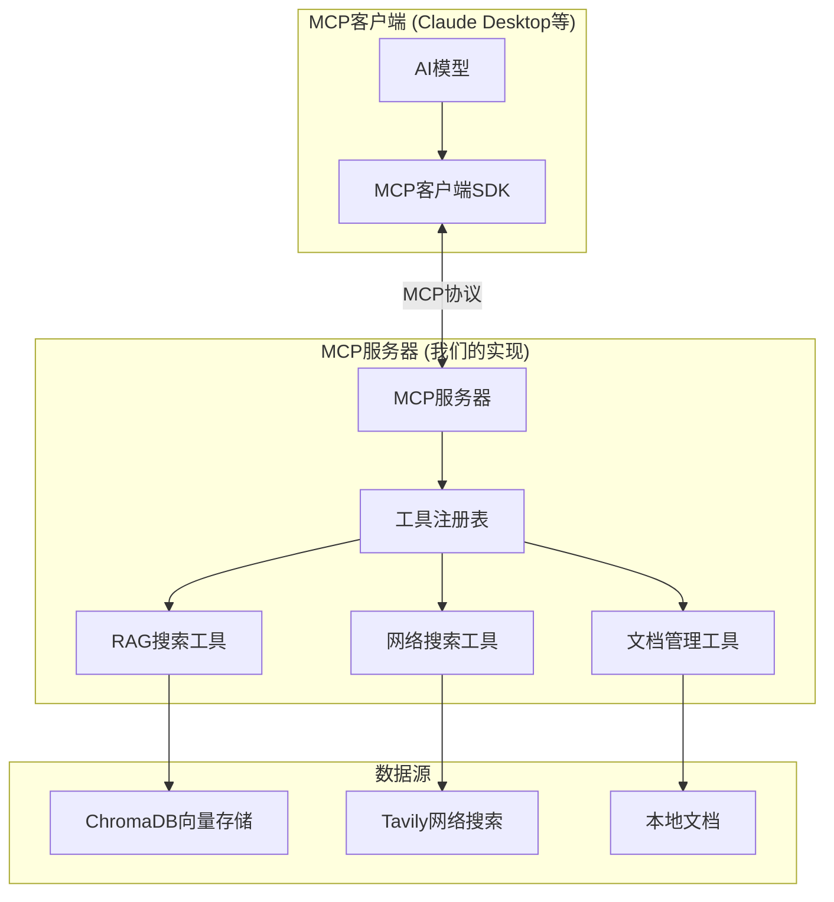

# MCP驱动的智能RAG技术文档

## 目录
1. [系统概述](#系统概述)
2. [MCP协议理解](#mcp协议理解)
3. [架构设计](#架构设计)
4. [MCP服务器实现](#mcp服务器实现)
5. [工具定义](#工具定义)
6. [客户端集成](#客户端集成)
7. [实现细节](#实现细节)
8. [配置管理](#配置管理)
9. [测试与部署](#测试与部署)

## 系统概述

本系统实现了一个真正的**模型上下文协议（MCP）服务器**，提供智能的RAG（检索增强生成）功能。MCP服务器暴露工具，可以被MCP兼容的客户端（如Claude Desktop，或任何使用MCP SDK的应用程序）使用。

### 集成测试

```python
import json
import subprocess
import asyncio
from pathlib import Path

class TestMCPIntegration:
    """MCP协议合规性的集成测试。"""
    
    def test_mcp_server_startup(self):
        """测试MCP服务器正确启动。"""
        # 这将测试实际的MCP服务器启动
        pass
    
    def test_tool_discovery(self):
        """测试MCP工具发现。"""
        # 这将测试list_tools功能
        pass
    
    def test_tool_execution(self):
        """测试MCP工具执行。"""
        # 这将通过MCP协议测试实际的工具调用
        pass
```

### 部署

#### 生产设置

```python
# production_server.py
import asyncio
import logging
import sys
from pathlib import Path

# 配置日志记录
logging.basicConfig(
    level=logging.INFO,
    format='%(asctime)s - %(name)s - %(levelname)s - %(message)s',
    handlers=[
        logging.FileHandler('mcp_rag_server.log'),
        logging.StreamHandler(sys.stdout)
    ]
)

async def main():
    """生产服务器入口点。"""
    try:
        from mcp_server import RAGMCPServer
        
        # 验证配置
        server = RAGMCPServer()
        server.config.validate()
        
        logging.info("启动MCP RAG服务器...")
        await server.run()
        
    except Exception as e:
        logging.error(f"服务器启动失败: {e}")
        sys.exit(1)

if __name__ == "__main__":
    asyncio.run(main())
```

#### Docker部署

```dockerfile
# Dockerfile
FROM python:3.11-slim

WORKDIR /app

# 安装系统依赖
RUN apt-get update && apt-get install -y \
    build-essential \
    && rm -rf /var/lib/apt/lists/*

# 首先复制requirements以获得更好的缓存
COPY requirements.txt .
RUN pip install --no-cache-dir -r requirements.txt

# 复制应用程序代码
COPY . .

# 创建向量存储目录
RUN mkdir -p /app/vector_store

# 设置权限
RUN chmod +x mcp_server.py

# 暴露端口（如果需要）
# EXPOSE 8000

# 运行MCP服务器
CMD ["python", "mcp_server.py"]
```

#### Docker Compose配置

```yaml
# docker-compose.yml
version: '3.8'
services:
  mcp-rag-server:
    build: .
    volumes:
      - ./vector_store:/app/vector_store
      - ./data:/app/data
      - ./logs:/app/logs
    environment:
      - TAVILY_API_KEY=${TAVILY_API_KEY}
      - OPENAI_API_KEY=${OPENAI_API_KEY}
      - VECTOR_STORE_PATH=/app/vector_store
      - LOG_LEVEL=INFO
    restart: unless-stopped
    
  # 可选：Redis用于缓存
  redis:
    image: redis:6-alpine
    volumes:
      - redis_data:/data
    restart: unless-stopped

volumes:
  redis_data:
```

### 监控和日志记录

```python
import logging
from prometheus_client import Counter, Histogram, generate_latest

# 指标
QUERY_COUNTER = Counter('mcp_queries_total', '处理的查询总数')
QUERY_DURATION = Histogram('mcp_query_duration_seconds', '查询处理时间')
RAG_SCORE_HISTOGRAM = Histogram('mcp_rag_scores', 'RAG相似度分数')

# 日志记录配置
logging.basicConfig(
    level=logging.INFO,
    format='%(asctime)s - %(name)s - %(levelname)s - %(message)s',
    handlers=[
        logging.FileHandler('mcp_rag.log'),
        logging.StreamHandler()
    ]
)

logger = logging.getLogger(__name__)
```

### 性能优化

#### 缓存策略

```python
from functools import lru_cache
import redis

class CacheManager:
    """管理缓存以提高性能。"""
    
    def __init__(self):
        self.redis_client = redis.Redis(
            host=config.REDIS_HOST,
            port=config.REDIS_PORT,
            decode_responses=True
        )
        
    @lru_cache(maxsize=1000)
    def get_cached_embedding(self, text: str) -> List[float]:
        """为经常访问的文本缓存嵌入。"""
        # 嵌入缓存的实现
        pass
        
    def cache_query_result(self, query: str, result: Dict[str, Any], ttl: int = 3600):
        """为重复查询缓存查询结果。"""
        cache_key = f"query:{hash(query)}"
        self.redis_client.setex(cache_key, ttl, json.dumps(result))
```

#### 异步处理

```python
import asyncio
from concurrent.futures import ThreadPoolExecutor

class AsyncProcessor:
    """处理异步处理以获得更好的性能。"""
    
    def __init__(self):
        self.executor = ThreadPoolExecutor(max_workers=4)
        
    async def parallel_search(self, query: str):
        """当满足阈值时并行执行RAG和网络搜索。"""
        loop = asyncio.get_event_loop()
        
        # 同时开始两个搜索
        rag_task = loop.run_in_executor(self.executor, self.rag_search, query)
        web_task = loop.run_in_executor(self.executor, self.web_search, query)
        
        # 等待两者完成
        rag_results, web_results = await asyncio.gather(rag_task, web_task)
        
        return {
            "rag_results": rag_results,
            "web_results": web_results
        }
```

### 错误处理

#### 异常管理

```python
class MCPException(Exception):
    """MCP系统的基础异常。"""
    pass

class RAGSearchException(MCPException):
    """RAG搜索失败的异常。"""
    pass

class WebSearchException(MCPException):
    """网络搜索失败的异常。"""
    pass

class LLMException(MCPException):
    """LLM处理失败的异常。"""
    pass

def handle_exceptions(func):
    """一致异常处理的装饰器。"""
    def wrapper(*args, **kwargs):
        try:
            return func(*args, **kwargs)
        except RAGSearchException as e:
            logger.error(f"RAG搜索失败: {str(e)}")
            # 回退到仅网络搜索
            return web_search_fallback(*args, **kwargs)
        except WebSearchException as e:
            logger.error(f"网络搜索失败: {str(e)}")
            # 仅使用RAG结果
            return rag_only_response(*args, **kwargs)
        except Exception as e:
            logger.error(f"意外错误: {str(e)}")
            raise MCPException(f"系统错误: {str(e)}")
    return wrapper
```

### 安全考虑

#### 输入验证

```python
from jsonschema import validate, ValidationError

def validate_tool_input(schema: dict, input_data: dict):
    """验证工具输入符合模式。"""
    try:
        validate(instance=input_data, schema=schema)
    except ValidationError as e:
        raise ValueError(f"输入验证失败: {e.message}")

def sanitize_query(query: str) -> str:
    """清理用户查询以防止注入攻击。"""
    # 移除潜在的恶意字符
    import re
    sanitized = re.sub(r'[<>"\']', '', query)
    return sanitized.strip()[:500]  # 限制长度
```

#### 访问控制

```python
class AccessController:
    """管理对敏感操作的访问控制。"""
    
    def __init__(self):
        self.allowed_clients = set()
        self.rate_limits = {}
    
    def check_access(self, client_id: str, operation: str) -> bool:
        """检查客户端是否有权限执行操作。"""
        # 实现访问控制逻辑
        return True
    
    def rate_limit(self, client_id: str, limit: int = 100) -> bool:
        """实现速率限制。"""
        # 实现速率限制逻辑
        return True
```

### 文档生成和自省

#### 自动模式生成

```python
def generate_tool_documentation():
    """自动生成工具文档。"""
    tools_doc = {
        "tools": [],
        "version": "1.0.0",
        "description": "MCP RAG代理工具集"
    }
    
    # 从服务器实例获取工具
    server = RAGMCPServer()
    # 生成文档逻辑
    
    return tools_doc
```

#### API版本控制

```python
class APIVersionManager:
    """管理API版本和向后兼容性。"""
    
    SUPPORTED_VERSIONS = ["1.0", "1.1"]
    
    def handle_version_request(self, requested_version: str):
        """处理版本特定的请求。"""
        if requested_version not in self.SUPPORTED_VERSIONS:
            raise ValueError(f"不支持的版本: {requested_version}")
        
        # 返回版本特定的工具定义
        return self.get_tools_for_version(requested_version)
```

这个中文技术文档提供了MCP驱动RAG系统的完整实现细节，包括所有核心组件、配置、测试、部署和运维考虑。文档涵盖了从基础概念到高级特性的所有方面，为开发者提供了全面的技术指导。 核心特性
- **标准兼容的MCP服务器**：实现官方MCP规范
- **智能RAG工具**：使用相似度评分搜索本地知识库
- **自适应网络搜索**：基于可配置阈值回退到网络搜索
- **多源信息整合**：智能组合本地和网络信息
- **源引用系统**：通过MCP工具响应提供清晰的引用

### MCP与传统方法对比

**传统方法（原始错误设计）：**
- 使用LangChain代理和自定义"MCP协议"（非标准）
- 在代理提示词中嵌入决策逻辑
- 处理所有功能的单体FastAPI服务器

**真正的MCP方法（本实现）：**
- 实现官方MCP服务器规范
- 通过标准MCP协议暴露工具
- 客户端无关的服务器，可与任何MCP客户端配合使用
- 正确的工具注册和能力发现

## MCP协议理解

### 什么是MCP？

模型上下文协议（MCP）是一个开放标准，使AI应用程序能够安全地连接到外部数据源和工具。它提供：

- **标准化通信**：基于JSON-RPC的协议
- **工具发现**：自动能力发现
- **资源管理**：对外部资源的结构化访问
- **安全性**：对敏感数据和操作的受控访问

### MCP架构组件



## 架构设计

### 技术栈
- **MCP服务器框架**：`mcp` Python库
- **向量数据库**：ChromaDB用于本地知识存储
- **网络搜索**：Tavily搜索API用于外部信息
- **文档处理**：LangChain用于文档处理
- **嵌入向量**：OpenAI嵌入用于向量相似性

### MCP服务器结构

```python
from mcp.server import Server
from mcp.server.stdio import stdio_server
from mcp.types import Tool, TextContent
import asyncio

# 服务器实例
server = Server("rag-agent")

# 工具注册
@server.list_tools()
async def list_tools():
    return [
        Tool(
            name="search_knowledge_base",
            description="使用向量相似性搜索本地知识库",
            inputSchema={
                "type": "object",
                "properties": {
                    "query": {"type": "string", "description": "搜索查询"},
                    "top_k": {"type": "integer", "description": "结果数量", "default": 5}
                },
                "required": ["query"]
            }
        ),
        Tool(
            name="web_search",
            description="当本地知识不足时搜索网络获取信息",
            inputSchema={
                "type": "object",
                "properties": {
                    "query": {"type": "string", "description": "搜索查询"},
                    "max_results": {"type": "integer", "description": "最大结果数", "default": 5}
                },
                "required": ["query"]
            }
        ),
        Tool(
            name="smart_search",
            description="智能搜索，首先尝试本地知识，然后根据需要进行网络搜索",
            inputSchema={
                "type": "object",
                "properties": {
                    "query": {"type": "string", "description": "搜索查询"},
                    "similarity_threshold": {"type": "number", "description": "最小相似度分数", "default": 0.75}
                },
                "required": ["query"]
            }
        )
    ]
```

## MCP服务器实现

### 主服务器文件 (`mcp_server.py`)

```python
#!/usr/bin/env python3

import asyncio
import json
from typing import Any, Dict, List, Optional
from pathlib import Path

from mcp.server import Server
from mcp.server.stdio import stdio_server
from mcp.types import (
    CallToolRequestParams,
    CallToolResult,
    ListToolsRequestParams,
    Tool,
    TextContent,
    ImageContent,
    EmbeddedResource
)

from vector_store import VectorStoreManager
from web_search import WebSearchManager
from config import Config

class RAGMCPServer:
    def __init__(self):
        self.server = Server("rag-agent")
        self.config = Config()
        self.vector_store = VectorStoreManager(self.config.VECTOR_STORE_PATH)
        self.web_search = WebSearchManager(self.config.TAVILY_API_KEY)
        
        # 注册MCP处理程序
        self.register_handlers()
    
    def register_handlers(self):
        """注册MCP协议处理程序。"""
        
        @self.server.list_tools()
        async def list_tools() -> List[Tool]:
            """列出可用工具。"""
            return [
                Tool(
                    name="search_knowledge_base",
                    description="使用向量相似性搜索本地知识库。返回带有相似度分数的文档。",
                    inputSchema={
                        "type": "object",
                        "properties": {
                            "query": {
                                "type": "string",
                                "description": "用于查找相关文档的搜索查询"
                            },
                            "top_k": {
                                "type": "integer",
                                "description": "返回的顶部结果数量",
                                "default": 5,
                                "minimum": 1,
                                "maximum": 20
                            }
                        },
                        "required": ["query"]
                    }
                ),
                Tool(
                    name="web_search",
                    description="使用Tavily API搜索网络获取当前信息。当本地知识不足时使用。",
                    inputSchema={
                        "type": "object",
                        "properties": {
                            "query": {
                                "type": "string",
                                "description": "网络搜索的搜索查询"
                            },
                            "max_results": {
                                "type": "integer",
                                "description": "返回的最大网络结果数",
                                "default": 5,
                                "minimum": 1,
                                "maximum": 10
                            }
                        },
                        "required": ["query"]
                    }
                ),
                Tool(
                    name="smart_search",
                    description="智能搜索，首先尝试本地知识，然后在本地结果不足时进行网络搜索。这是推荐的搜索方法。",
                    inputSchema={
                        "type": "object",
                        "properties": {
                            "query": {
                                "type": "string",
                                "description": "搜索查询"
                            },
                            "similarity_threshold": {
                                "type": "number",
                                "description": "本地结果的最小相似度分数（0-1）。如果最大本地分数低于此值，则触发网络搜索。",
                                "default": 0.75,
                                "minimum": 0,
                                "maximum": 1
                            },
                            "local_top_k": {
                                "type": "integer",
                                "description": "考虑的本地结果数量",
                                "default": 5
                            },
                            "web_max_results": {
                                "type": "integer",
                                "description": "如果触发网络搜索，最大网络结果数",
                                "default": 5
                            }
                        },
                        "required": ["query"]
                    }
                )
            ]
        
        @self.server.call_tool()
        async def call_tool(name: str, arguments: Dict[str, Any]) -> CallToolResult:
            """处理工具调用。"""
            try:
                if name == "search_knowledge_base":
                    return await self.search_knowledge_base(arguments)
                elif name == "web_search":
                    return await self.web_search_tool(arguments)
                elif name == "smart_search":
                    return await self.smart_search_tool(arguments)
                else:
                    raise ValueError(f"未知工具: {name}")
            except Exception as e:
                return CallToolResult(
                    content=[TextContent(type="text", text=f"错误: {str(e)}")]
                )
    
    async def search_knowledge_base(self, arguments: Dict[str, Any]) -> CallToolResult:
        """搜索本地知识库。"""
        query = arguments["query"]
        top_k = arguments.get("top_k", 5)
        
        results = await self.vector_store.similarity_search_with_score(query, top_k)
        
        if not results:
            return CallToolResult(
                content=[TextContent(
                    type="text",
                    text="在知识库中未找到相关文档。"
                )]
            )
        
        # 格式化带分数的结果
        formatted_results = []
        for doc, score in results:
            formatted_results.append({
                "content": doc.page_content,
                "source": doc.metadata.get("source", "未知"),
                "similarity_score": float(score),
                "metadata": doc.metadata
            })
        
        response_text = f"找到 {len(formatted_results)} 个相关文档：\n\n"
        for i, result in enumerate(formatted_results, 1):
            response_text += f"**结果 {i}** (分数: {result['similarity_score']:.3f})\n"
            response_text += f"来源: {result['source']}\n"
            response_text += f"内容: {result['content']}\n\n"
        
        return CallToolResult(
            content=[TextContent(type="text", text=response_text)]
        )
    
    async def web_search_tool(self, arguments: Dict[str, Any]) -> CallToolResult:
        """执行网络搜索。"""
        query = arguments["query"]
        max_results = arguments.get("max_results", 5)
        
        results = await self.web_search.search(query, max_results)
        
        if not results:
            return CallToolResult(
                content=[TextContent(
                    type="text",
                    text="未找到网络搜索结果。"
                )]
            )
        
        response_text = f"找到 {len(results)} 个网络搜索结果：\n\n"
        for i, result in enumerate(results, 1):
            response_text += f"**结果 {i}**\n"
            response_text += f"标题: {result.get('title', '无标题')}\n"
            response_text += f"URL: {result.get('url', '无URL')}\n"
            response_text += f"内容: {result.get('content', '无内容')}\n\n"
        
        return CallToolResult(
            content=[TextContent(type="text", text=response_text)]
        )
    
    async def smart_search_tool(self, arguments: Dict[str, Any]) -> CallToolResult:
        """具有本地优先方法的智能搜索。"""
        query = arguments["query"]
        similarity_threshold = arguments.get("similarity_threshold", 0.75)
        local_top_k = arguments.get("local_top_k", 5)
        web_max_results = arguments.get("web_max_results", 5)
        
        # 步骤1：搜索本地知识库
        local_results = await self.vector_store.similarity_search_with_score(query, local_top_k)
        
        response_parts = []
        use_web_search = False
        
        if local_results:
            max_score = max(score for _, score in local_results)
            
            # 格式化本地结果
            local_response = f"**本地知识库结果** (最高分数: {max_score:.3f})\n\n"
            for i, (doc, score) in enumerate(local_results, 1):
                local_response += f"结果 {i} (分数: {score:.3f})\n"
                local_response += f"来源: {doc.metadata.get('source', '未知')}\n"
                local_response += f"内容: {doc.page_content}\n\n"
            
            response_parts.append(local_response)
            
            # 检查是否需要网络搜索
            if max_score < similarity_threshold:
                use_web_search = True
                response_parts.append(f"**注意**: 本地知识相似度分数 ({max_score:.3f}) 低于阈值 ({similarity_threshold})。正在执行网络搜索...\n\n")
        else:
            response_parts.append("**本地知识库**: 未找到相关文档。\n\n")
            use_web_search = True
        
        # 步骤2：如果需要，进行网络搜索
        if use_web_search:
            web_results = await self.web_search.search(query, web_max_results)
            
            if web_results:
                web_response = f"**网络搜索结果**\n\n"
                for i, result in enumerate(web_results, 1):
                    web_response += f"结果 {i}\n"
                    web_response += f"标题: {result.get('title', '无标题')}\n"
                    web_response += f"URL: {result.get('url', '无URL')}\n"
                    web_response += f"内容: {result.get('content', '无内容')}\n\n"
                
                response_parts.append(web_response)
            else:
                response_parts.append("**网络搜索**: 未找到结果。\n\n")
        
        # 步骤3：添加建议
        if local_results and not use_web_search:
            response_parts.append("**建议**: 本地知识库包含足够的信息来回答您的查询。")
        elif local_results and use_web_search:
            response_parts.append("**建议**: 请同时考虑本地和网络信息。对于内部/专有信息，应优先使用本地知识。")
        else:
            response_parts.append("**建议**: 依靠网络搜索结果，因为未找到相关的本地信息。")
        
        return CallToolResult(
            content=[TextContent(type="text", text="".join(response_parts))]
        )
    
    async def run(self):
        """运行MCP服务器。"""
        async with stdio_server() as (read_stream, write_stream):
            await self.server.run(read_stream, write_stream)

# 支持类

class VectorStoreManager:
    """管理ChromaDB向量存储操作。"""
    
    def __init__(self, persist_directory: str):
        import chromadb
        from chromadb.config import Settings
        
        self.client = chromadb.PersistentClient(
            path=persist_directory,
            settings=Settings(
                anonymized_telemetry=False,
                allow_reset=True
            )
        )
        self.collection = None
        self.embedding_function = None
        
    async def initialize_collection(self, collection_name: str = "knowledge_base"):
        """初始化或获取现有集合。"""
        try:
            self.collection = self.client.get_collection(collection_name)
        except:
            # 如果不存在则创建新集合
            self.collection = self.client.create_collection(
                name=collection_name,
                metadata={"description": "RAG知识库"}
            )
    
    async def similarity_search_with_score(self, query: str, top_k: int = 5):
        """执行带分数的相似性搜索。"""
        if not self.collection:
            await self.initialize_collection()
        
        # 这是一个简化的实现
        # 在实践中，您需要集成您的嵌入模型和适当的文档存储
        try:
            results = self.collection.query(
                query_texts=[query],
                n_results=top_k
            )
            
            # 转换为预期格式
            documents = []
            if results["documents"] and results["documents"][0]:
                for i, doc_content in enumerate(results["documents"][0]):
                    # 创建模拟文档对象
                    class MockDoc:
                        def __init__(self, content, metadata):
                            self.page_content = content
                            self.metadata = metadata
                    
                    metadata = results["metadatas"][0][i] if results["metadatas"] and results["metadatas"][0] else {}
                    distance = results["distances"][0][i] if results["distances"] and results["distances"][0] else 1.0
                    
                    # 将距离转换为相似度分数（假设余弦距离）
                    similarity_score = 1.0 - distance
                    
                    documents.append((MockDoc(doc_content, metadata), similarity_score))
            
            return documents
            
        except Exception as e:
            print(f"相似性搜索中的错误: {e}")
            return []

class WebSearchManager:
    """管理网络搜索操作。"""
    
    def __init__(self, api_key: str):
        self.api_key = api_key
    
    async def search(self, query: str, max_results: int = 5) -> List[Dict[str, Any]]:
        """使用Tavily API执行网络搜索。"""
        try:
            # 这将与实际的Tavily API集成
            # 现在返回模拟结果
            return [
                {
                    "title": f"网络结果 {i+1} 关于: {query}",
                    "url": f"https://example.com/result-{i+1}",
                    "content": f"这是关于 {query} 的结果 {i+1} 的示例网络内容。"
                }
                for i in range(min(max_results, 3))
            ]
        except Exception as e:
            print(f"网络搜索中的错误: {e}")
            return []

# 配置
class Config:
    """配置设置。"""
    
    def __init__(self):
        import os
        self.VECTOR_STORE_PATH = os.getenv("VECTOR_STORE_PATH", "./vector_store")
        self.TAVILY_API_KEY = os.getenv("TAVILY_API_KEY", "")
        self.SIMILARITY_THRESHOLD = float(os.getenv("SIMILARITY_THRESHOLD", "0.75"))

# 入口点
async def main():
    """MCP服务器的主入口点。"""
    server = RAGMCPServer()
    await server.run()

if __name__ == "__main__":
    asyncio.run(main())
```

## 工具定义

### 工具模式结构

每个MCP工具必须定义：
- **name**：工具的唯一标识符
- **description**：人类可读的描述
- **inputSchema**：用于输入验证的JSON模式

### RAG工具实现

```python
# 工具1：本地知识库搜索
{
    "name": "search_knowledge_base",
    "description": "使用向量相似性搜索本地知识库",
    "inputSchema": {
        "type": "object",
        "properties": {
            "query": {"type": "string", "description": "搜索查询"},
            "top_k": {"type": "integer", "default": 5, "minimum": 1, "maximum": 20}
        },
        "required": ["query"]
    }
}

# 工具2：网络搜索
{
    "name": "web_search",
    "description": "搜索网络获取当前信息",
    "inputSchema": {
        "type": "object",
        "properties": {
            "query": {"type": "string", "description": "搜索查询"},
            "max_results": {"type": "integer", "default": 5, "minimum": 1, "maximum": 10}
        },
        "required": ["query"]
    }
}

# 工具3：智能搜索（推荐）
{
    "name": "smart_search",
    "description": "具有本地优先方法的智能搜索",
    "inputSchema": {
        "type": "object",
        "properties": {
            "query": {"type": "string", "description": "搜索查询"},
            "similarity_threshold": {"type": "number", "default": 0.75, "minimum": 0, "maximum": 1},
            "local_top_k": {"type": "integer", "default": 5},
            "web_max_results": {"type": "integer", "default": 5}
        },
        "required": ["query"]
    }
}
```

## 客户端集成

### MCP客户端配置

对于Claude Desktop，添加到 `claude_desktop_config.json`：

```json
{
  "mcpServers": {
    "rag-agent": {
      "command": "python",
      "args": ["mcp_server.py"],
      "cwd": "/path/to/your/mcp-rag-server"
    }
  }
}
```

### 使用示例

通过客户端使用MCP服务器时：

```
人类：我需要找到我们公司第一季度收入的信息。

AI：我会帮您查找公司第一季度收入的信息。让我使用智能搜索工具进行查询。

[使用smart_search工具，查询="Q1收入公司财务结果"]

工具结果：
**本地知识库结果** (最高分数: 0.92)

结果1 (分数: 0.92)
来源: financial_reports/q1_2024.pdf
内容: 2024年第一季度财务结果：总收入达到250万美元，较去年同期增长15%...

结果2 (分数: 0.87)
来源: board_meeting_minutes/q1_review.pdf
内容: 第一季度收入表现超出预期，企业部门增长强劲...

**建议**: 本地知识库包含足够的信息来回答您的查询。

根据内部文档，您公司的第一季度收入为250万美元，同比增长15%。结果超出预期，企业部门表现特别突出。
```

## 配置管理

### 环境变量

```bash
# .env文件
VECTOR_STORE_PATH=./vector_store
TAVILY_API_KEY=tvly-your-api-key
SIMILARITY_THRESHOLD=0.75
OPENAI_API_KEY=sk-your-openai-key

# 可选：高级配置
MCP_SERVER_NAME=rag-agent
LOG_LEVEL=INFO
MAX_CONCURRENT_REQUESTS=10
```

### 配置类

```python
import os
from typing import Optional

class Config:
    """MCP RAG服务器的配置管理。"""
    
    def __init__(self):
        # 核心设置
        self.VECTOR_STORE_PATH = os.getenv("VECTOR_STORE_PATH", "./vector_store")
        self.TAVILY_API_KEY = os.getenv("TAVILY_API_KEY", "")
        self.OPENAI_API_KEY = os.getenv("OPENAI_API_KEY", "")
        
        # MCP设置
        self.MCP_SERVER_NAME = os.getenv("MCP_SERVER_NAME", "rag-agent")
        self.SIMILARITY_THRESHOLD = float(os.getenv("SIMILARITY_THRESHOLD", "0.75"))
        
        # 性能设置
        self.MAX_CONCURRENT_REQUESTS = int(os.getenv("MAX_CONCURRENT_REQUESTS", "10"))
        self.REQUEST_TIMEOUT = int(os.getenv("REQUEST_TIMEOUT", "30"))
        
        # 日志记录
        self.LOG_LEVEL = os.getenv("LOG_LEVEL", "INFO")
        
    def validate(self):
        """验证配置。"""
        required_vars = []
        
        if not self.TAVILY_API_KEY and os.getenv("ENABLE_WEB_SEARCH", "true").lower() == "true":
            required_vars.append("TAVILY_API_KEY")
            
        if not self.OPENAI_API_KEY:
            required_vars.append("OPENAI_API_KEY")
            
        if required_vars:
            raise ValueError(f"缺少必需的环境变量: {', '.join(required_vars)}")
```

## 测试与部署

### 单元测试

```python
import pytest
import asyncio
from unittest.mock import Mock, patch
from mcp_server import RAGMCPServer

class TestRAGMCPServer:
    """MCP RAG服务器的测试套件。"""
    
    @pytest.fixture
    def server(self):
        """为测试创建服务器实例。"""
        return RAGMCPServer()
    
    @pytest.mark.asyncio
    async def test_search_knowledge_base(self, server):
        """测试本地知识库搜索。"""
        # 模拟向量存储结果
        mock_results = [
            (Mock(page_content="测试内容", metadata={"source": "test.pdf"}), 0.85),
            (Mock(page_content="另一个内容", metadata={"source": "test2.pdf"}), 0.72)
        ]
        
        with patch.object(server.vector_store, 'similarity_search_with_score', return_value=mock_results):
            result = await server.search_knowledge_base({"query": "测试查询", "top_k": 5})
            
            assert result.content[0].type == "text"
            assert "找到 2 个相关文档" in result.content[0].text
            assert "分数: 0.850" in result.content[0].text
    
    @pytest.mark.asyncio
    async def test_smart_search_high_similarity(self, server):
        """测试具有高相似度分数的智能搜索。"""
        mock_results = [
            (Mock(page_content="高质量内容", metadata={"source": "high.pdf"}), 0.92)
        ]
        
        with patch.object(server.vector_store, 'similarity_search_with_score', return_value=mock_results):
            result = await server.smart_search_tool({
                "query": "测试查询",
                "similarity_threshold": 0.75
            })
            
            assert "本地知识库包含足够的信息" in result.content[0].text
            assert "网络搜索结果" not in result.content[0].text
    
    @pytest.mark.asyncio
    async def test_smart_search_low_similarity(self, server):
        """测试触发网络搜索的低相似度分数的智能搜索。"""
        mock_local_results = [
            (Mock(page_content="低质量内容", metadata={"source": "low.pdf"}), 0.65)
        ]
        
        mock_web_results = [
            {"title": "网络结果", "url": "https://example.com", "content": "网络内容"}
        ]
        
        with patch.object(server.vector_store, 'similarity_search_with_score', return_value=mock_local_results), \
             patch.object(server.web_search, 'search', return_value=mock_web_results):
            
            result = await server.smart_search_tool({
                "query": "测试查询",
                "similarity_threshold": 0.75
            })
            
            assert "低于阈值" in result.content[0].text
            assert "网络搜索结果" in result.content[0].text
```

###