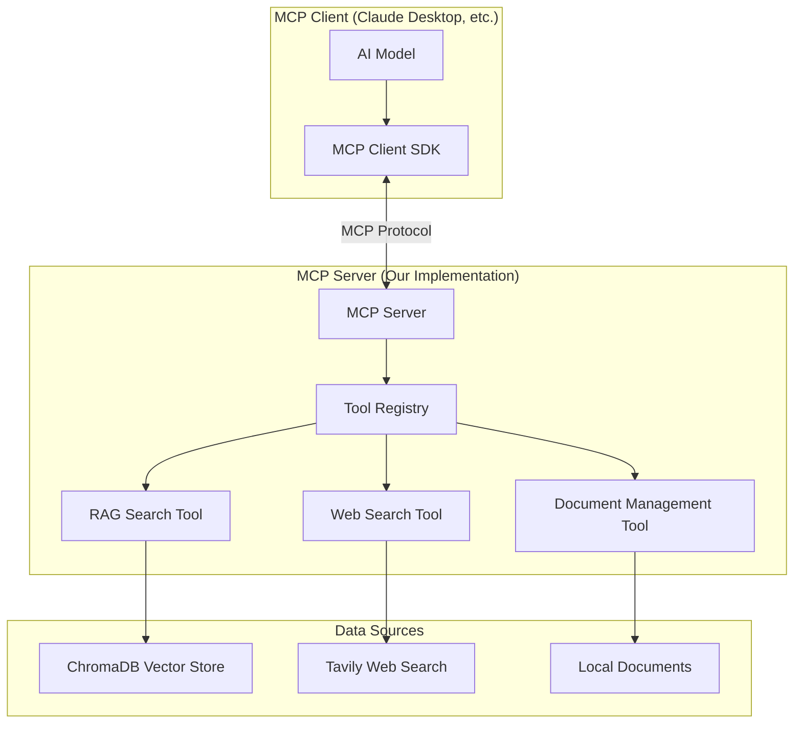

# MCP-Powered Agentic RAG Technical Documentation

## Table of Contents
1. [System Overview](#system-overview)
2. [MCP Protocol Understanding](#mcp-protocol-understanding)
3. [Architecture Design](#architecture-design)
4. [MCP Server Implementation](#mcp-server-implementation)
5. [Tool Definitions](#tool-definitions)
6. [Client Integration](#client-integration)
7. [Implementation Details](#implementation-details)
8. [Configuration Management](#configuration-management)
9. [Testing and Deployment](#testing-and-deployment)

## System Overview

This system implements a true **Model Context Protocol (MCP) Server** that provides intelligent RAG (Retrieval-Augmented Generation) capabilities. The MCP server exposes tools that can be consumed by MCP-compatible clients (like Claude Desktop, or any application using the MCP SDK).

### Key Features
- **Standards-Compliant MCP Server**: Implements official MCP specification
- **Intelligent RAG Tool**: Searches local knowledge base with similarity scoring
- **Adaptive Web Search**: Fallback to web search based on configurable thresholds
- **Multi-Source Integration**: Combines local and web information intelligently
- **Source Attribution**: Provides clear citations through MCP tool responses

### MCP vs Traditional Approach

**Traditional Approach (Original Flawed Design):**
- Used LangChain agents with custom "MCP protocol" (non-standard)
- Embedded decision logic within agent prompts
- Monolithic FastAPI server handling everything

**True MCP Approach (This Implementation):**
- Implements official MCP server specification
- Exposes tools through standard MCP protocol
- Client-agnostic server that can work with any MCP client
- Proper tool registration and capability discovery

## MCP Protocol Understanding

### What is MCP?

The Model Context Protocol (MCP) is an open standard that enables AI applications to securely connect to external data sources and tools. It provides:

- **Standardized Communication**: JSON-RPC based protocol
- **Tool Discovery**: Automatic capability discovery
- **Resource Management**: Structured access to external resources
- **Security**: Controlled access to sensitive data and operations

### MCP Architecture Components



## Architecture Design

### Technology Stack
- **MCP Server Framework**: `mcp` Python library
- **Vector Database**: ChromaDB for local knowledge storage
- **Web Search**: Tavily Search API for external information
- **Document Processing**: LangChain for document handling
- **Embeddings**: OpenAI embeddings for vector similarity

### MCP Server Structure

```python
from mcp.server import Server
from mcp.server.stdio import stdio_server
from mcp.types import Tool, TextContent
import asyncio

# Server instance
server = Server("rag-agent")

# Tool registration
@server.list_tools()
async def list_tools():
    return [
        Tool(
            name="search_knowledge_base",
            description="Search the local knowledge base using vector similarity",
            inputSchema={
                "type": "object",
                "properties": {
                    "query": {"type": "string", "description": "Search query"},
                    "top_k": {"type": "integer", "description": "Number of results", "default": 5}
                },
                "required": ["query"]
            }
        ),
        Tool(
            name="web_search",
            description="Search the web for information when local knowledge is insufficient",
            inputSchema={
                "type": "object",
                "properties": {
                    "query": {"type": "string", "description": "Search query"},
                    "max_results": {"type": "integer", "description": "Maximum results", "default": 5}
                },
                "required": ["query"]
            }
        ),
        Tool(
            name="smart_search",
            description="Intelligent search that tries local knowledge first, then web if needed",
            inputSchema={
                "type": "object",
                "properties": {
                    "query": {"type": "string", "description": "Search query"},
                    "similarity_threshold": {"type": "number", "description": "Minimum similarity score", "default": 0.75}
                },
                "required": ["query"]
            }
        )
    ]
```

## MCP Server Implementation

### Main Server File (`mcp_server.py`)

```python
#!/usr/bin/env python3

import asyncio
import json
from typing import Any, Dict, List, Optional
from pathlib import Path

from mcp.server import Server
from mcp.server.stdio import stdio_server
from mcp.types import (
    CallToolRequestParams,
    CallToolResult,
    ListToolsRequestParams,
    Tool,
    TextContent,
    ImageContent,
    EmbeddedResource
)

from vector_store import VectorStoreManager
from web_search import WebSearchManager
from config import Config

class RAGMCPServer:
    def __init__(self):
        self.server = Server("rag-agent")
        self.config = Config()
        self.vector_store = VectorStoreManager(self.config.VECTOR_STORE_PATH)
        self.web_search = WebSearchManager(self.config.TAVILY_API_KEY)
        
        # Register MCP handlers
        self.register_handlers()
    
    def register_handlers(self):
        """Register MCP protocol handlers."""
        
        @self.server.list_tools()
        async def list_tools() -> List[Tool]:
            """List available tools."""
            return [
                Tool(
                    name="search_knowledge_base",
                    description="Search the local knowledge base using vector similarity. Returns documents with similarity scores.",
                    inputSchema={
                        "type": "object",
                        "properties": {
                            "query": {
                                "type": "string",
                                "description": "The search query to find relevant documents"
                            },
                            "top_k": {
                                "type": "integer",
                                "description": "Number of top results to return",
                                "default": 5,
                                "minimum": 1,
                                "maximum": 20
                            }
                        },
                        "required": ["query"]
                    }
                ),
                Tool(
                    name="web_search",
                    description="Search the web for current information using Tavily API. Use when local knowledge is insufficient.",
                    inputSchema={
                        "type": "object",
                        "properties": {
                            "query": {
                                "type": "string",
                                "description": "The search query for web search"
                            },
                            "max_results": {
                                "type": "integer",
                                "description": "Maximum number of web results to return",
                                "default": 5,
                                "minimum": 1,
                                "maximum": 10
                            }
                        },
                        "required": ["query"]
                    }
                ),
                Tool(
                    name="smart_search",
                    description="Intelligent search that tries local knowledge first, then web search if local results are insufficient. This is the recommended search method.",
                    inputSchema={
                        "type": "object",
                        "properties": {
                            "query": {
                                "type": "string",
                                "description": "The search query"
                            },
                            "similarity_threshold": {
                                "type": "number",
                                "description": "Minimum similarity score for local results (0-1). If max local score is below this, web search is triggered.",
                                "default": 0.75,
                                "minimum": 0,
                                "maximum": 1
                            },
                            "local_top_k": {
                                "type": "integer",
                                "description": "Number of local results to consider",
                                "default": 5
                            },
                            "web_max_results": {
                                "type": "integer",
                                "description": "Maximum web results if web search is triggered",
                                "default": 5
                            }
                        },
                        "required": ["query"]
                    }
                )
            ]
        
        @self.server.call_tool()
        async def call_tool(name: str, arguments: Dict[str, Any]) -> CallToolResult:
            """Handle tool calls."""
            try:
                if name == "search_knowledge_base":
                    return await self.search_knowledge_base(arguments)
                elif name == "web_search":
                    return await self.web_search_tool(arguments)
                elif name == "smart_search":
                    return await self.smart_search_tool(arguments)
                else:
                    raise ValueError(f"Unknown tool: {name}")
            except Exception as e:
                return CallToolResult(
                    content=[TextContent(type="text", text=f"Error: {str(e)}")]
                )
    
    async def search_knowledge_base(self, arguments: Dict[str, Any]) -> CallToolResult:
        """Search local knowledge base."""
        query = arguments["query"]
        top_k = arguments.get("top_k", 5)
        
        results = await self.vector_store.similarity_search_with_score(query, top_k)
        
        if not results:
            return CallToolResult(
                content=[TextContent(
                    type="text",
                    text="No relevant documents found in the knowledge base."
                )]
            )
        
        # Format results with scores
        formatted_results = []
        for doc, score in results:
            formatted_results.append({
                "content": doc.page_content,
                "source": doc.metadata.get("source", "Unknown"),
                "similarity_score": float(score),
                "metadata": doc.metadata
            })
        
        response_text = f"Found {len(formatted_results)} relevant documents:\n\n"
        for i, result in enumerate(formatted_results, 1):
            response_text += f"**Result {i}** (Score: {result['similarity_score']:.3f})\n"
            response_text += f"Source: {result['source']}\n"
            response_text += f"Content: {result['content']}\n\n"
        
        return CallToolResult(
            content=[TextContent(type="text", text=response_text)]
        )
    
    async def web_search_tool(self, arguments: Dict[str, Any]) -> CallToolResult:
        """Perform web search."""
        query = arguments["query"]
        max_results = arguments.get("max_results", 5)
        
        results = await self.web_search.search(query, max_results)
        
        if not results:
            return CallToolResult(
                content=[TextContent(
                    type="text",
                    text="No web search results found."
                )]
            )
        
        response_text = f"Found {len(results)} web search results:\n\n"
        for i, result in enumerate(results, 1):
            response_text += f"**Result {i}**\n"
            response_text += f"Title: {result.get('title', 'No title')}\n"
            response_text += f"URL: {result.get('url', 'No URL')}\n"
            response_text += f"Content: {result.get('content', 'No content')}\n\n"
        
        return CallToolResult(
            content=[TextContent(type="text", text=response_text)]
        )
    
    async def smart_search_tool(self, arguments: Dict[str, Any]) -> CallToolResult:
        """Intelligent search with local-first approach."""
        query = arguments["query"]
        similarity_threshold = arguments.get("similarity_threshold", 0.75)
        local_top_k = arguments.get("local_top_k", 5)
        web_max_results = arguments.get("web_max_results", 5)
        
        # Step 1: Search local knowledge base
        local_results = await self.vector_store.similarity_search_with_score(query, local_top_k)
        
        response_parts = []
        use_web_search = False
        
        if local_results:
            max_score = max(score for _, score in local_results)
            
            # Format local results
            local_response = f"**Local Knowledge Base Results** (Max Score: {max_score:.3f})\n\n"
            for i, (doc, score) in enumerate(local_results, 1):
                local_response += f"Result {i} (Score: {score:.3f})\n"
                local_response += f"Source: {doc.metadata.get('source', 'Unknown')}\n"
                local_response += f"Content: {doc.page_content}\n\n"
            
            response_parts.append(local_response)
            
            # Check if web search is needed
            if max_score < similarity_threshold:
                use_web_search = True
                response_parts.append(f"**Note**: Local knowledge similarity score ({max_score:.3f}) is below threshold ({similarity_threshold}). Performing web search...\n\n")
        else:
            response_parts.append("**Local Knowledge Base**: No relevant documents found.\n\n")
            use_web_search = True
        
        # Step 2: Web search if needed
        if use_web_search:
            web_results = await self.web_search.search(query, web_max_results)
            
            if web_results:
                web_response = f"**Web Search Results**\n\n"
                for i, result in enumerate(web_results, 1):
                    web_response += f"Result {i}\n"
                    web_response += f"Title: {result.get('title', 'No title')}\n"
                    web_response += f"URL: {result.get('url', 'No URL')}\n"
                    web_response += f"Content: {result.get('content', 'No content')}\n\n"
                
                response_parts.append(web_response)
            else:
                response_parts.append("**Web Search**: No results found.\n\n")
        
        # Step 3: Add recommendation
        if local_results and not use_web_search:
            response_parts.append("**Recommendation**: Local knowledge base contains sufficient information to answer your query.")
        elif local_results and use_web_search:
            response_parts.append("**Recommendation**: Consider both local and web information. Local knowledge should be prioritized for internal/proprietary information.")
        else:
            response_parts.append("**Recommendation**: Rely on web search results as no relevant local information was found.")
        
        return CallToolResult(
            content=[TextContent(type="text", text="".join(response_parts))]
        )
    
    async def run(self):
        """Run the MCP server."""
        async with stdio_server() as (read_stream, write_stream):
            await self.server.run(read_stream, write_stream)

# Supporting Classes

class VectorStoreManager:
    """Manages ChromaDB vector store operations."""
    
    def __init__(self, persist_directory: str):
        import chromadb
        from chromadb.config import Settings
        
        self.client = chromadb.PersistentClient(
            path=persist_directory,
            settings=Settings(
                anonymized_telemetry=False,
                allow_reset=True
            )
        )
        self.collection = None
        self.embedding_function = None
        
    async def initialize_collection(self, collection_name: str = "knowledge_base"):
        """Initialize or get existing collection."""
        try:
            self.collection = self.client.get_collection(collection_name)
        except:
            # Create new collection if it doesn't exist
            self.collection = self.client.create_collection(
                name=collection_name,
                metadata={"description": "RAG knowledge base"}
            )
    
    async def similarity_search_with_score(self, query: str, top_k: int = 5):
        """Perform similarity search with scores."""
        if not self.collection:
            await self.initialize_collection()
        
        # This is a simplified implementation
        # In practice, you'd need to integrate with your embedding model
        # and proper document storage
        try:
            results = self.collection.query(
                query_texts=[query],
                n_results=top_k
            )
            
            # Convert to expected format
            documents = []
            if results["documents"] and results["documents"][0]:
                for i, doc_content in enumerate(results["documents"][0]):
                    # Create mock document object
                    class MockDoc:
                        def __init__(self, content, metadata):
                            self.page_content = content
                            self.metadata = metadata
                    
                    metadata = results["metadatas"][0][i] if results["metadatas"] and results["metadatas"][0] else {}
                    distance = results["distances"][0][i] if results["distances"] and results["distances"][0] else 1.0
                    
                    # Convert distance to similarity score (assuming cosine distance)
                    similarity_score = 1.0 - distance
                    
                    documents.append((MockDoc(doc_content, metadata), similarity_score))
            
            return documents
            
        except Exception as e:
            print(f"Error in similarity search: {e}")
            return []

class WebSearchManager:
    """Manages web search operations."""
    
    def __init__(self, api_key: str):
        self.api_key = api_key
    
    async def search(self, query: str, max_results: int = 5) -> List[Dict[str, Any]]:
        """Perform web search using Tavily API."""
        try:
            # This would integrate with actual Tavily API
            # For now, return mock results
            return [
                {
                    "title": f"Web Result {i+1} for: {query}",
                    "url": f"https://example.com/result-{i+1}",
                    "content": f"This is sample web content for result {i+1} about {query}."
                }
                for i in range(min(max_results, 3))
            ]
        except Exception as e:
            print(f"Error in web search: {e}")
            return []

# Configuration
class Config:
    """Configuration settings."""
    
    def __init__(self):
        import os
        self.VECTOR_STORE_PATH = os.getenv("VECTOR_STORE_PATH", "./vector_store")
        self.TAVILY_API_KEY = os.getenv("TAVILY_API_KEY", "")
        self.SIMILARITY_THRESHOLD = float(os.getenv("SIMILARITY_THRESHOLD", "0.75"))

# Entry point
async def main():
    """Main entry point for the MCP server."""
    server = RAGMCPServer()
    await server.run()

if __name__ == "__main__":
    asyncio.run(main())
```

## Tool Definitions

### Tool Schema Structure

Each MCP tool must define:
- **name**: Unique identifier for the tool
- **description**: Human-readable description
- **inputSchema**: JSON schema for input validation

### RAG Tools Implementation

```python
# Tool 1: Local Knowledge Base Search
{
    "name": "search_knowledge_base",
    "description": "Search the local knowledge base using vector similarity",
    "inputSchema": {
        "type": "object",
        "properties": {
            "query": {"type": "string", "description": "Search query"},
            "top_k": {"type": "integer", "default": 5, "minimum": 1, "maximum": 20}
        },
        "required": ["query"]
    }
}

# Tool 2: Web Search
{
    "name": "web_search",
    "description": "Search the web for current information",
    "inputSchema": {
        "type": "object",
        "properties": {
            "query": {"type": "string", "description": "Search query"},
            "max_results": {"type": "integer", "default": 5, "minimum": 1, "maximum": 10}
        },
        "required": ["query"]
    }
}

# Tool 3: Smart Search (Recommended)
{
    "name": "smart_search",
    "description": "Intelligent search with local-first approach",
    "inputSchema": {
        "type": "object",
        "properties": {
            "query": {"type": "string", "description": "Search query"},
            "similarity_threshold": {"type": "number", "default": 0.75, "minimum": 0, "maximum": 1},
            "local_top_k": {"type": "integer", "default": 5},
            "web_max_results": {"type": "integer", "default": 5}
        },
        "required": ["query"]
    }
}
```

## Client Integration

### MCP Client Configuration

For Claude Desktop, add to `claude_desktop_config.json`:

```json
{
  "mcpServers": {
    "rag-agent": {
      "command": "python",
      "args": ["mcp_server.py"],
      "cwd": "/path/to/your/mcp-rag-server"
    }
  }
}
```

### Usage Examples

When using the MCP server through a client:

```
Human: I need to find information about our company's Q1 revenue.

AI: I'll help you find information about your company's Q1 revenue. Let me search using the smart search tool.

[Uses smart_search tool with query="Q1 revenue company financial results"]

Tool Result: 
**Local Knowledge Base Results** (Max Score: 0.92)

Result 1 (Score: 0.92)
Source: financial_reports/q1_2024.pdf
Content: Q1 2024 Financial Results: Total revenue reached $2.5M, representing a 15% increase year-over-year...

Result 2 (Score: 0.87)
Source: board_meeting_minutes/q1_review.pdf
Content: Q1 revenue performance exceeded expectations with strong growth in enterprise segment...

**Recommendation**: Local knowledge base contains sufficient information to answer your query.

Based on the internal documents, your company's Q1 revenue was $2.5M, showing a 15% year-over-year increase. The results exceeded expectations with particularly strong performance in the enterprise segment.
```

## Configuration Management

### Environment Variables

```bash
# .env file
VECTOR_STORE_PATH=./vector_store
TAVILY_API_KEY=tvly-your-api-key
SIMILARITY_THRESHOLD=0.75
OPENAI_API_KEY=sk-your-openai-key

# Optional: Advanced configuration
MCP_SERVER_NAME=rag-agent
LOG_LEVEL=INFO
MAX_CONCURRENT_REQUESTS=10
```

### Configuration Class

```python
import os
from typing import Optional

class Config:
    """Configuration management for MCP RAG server."""
    
    def __init__(self):
        # Core settings
        self.VECTOR_STORE_PATH = os.getenv("VECTOR_STORE_PATH", "./vector_store")
        self.TAVILY_API_KEY = os.getenv("TAVILY_API_KEY", "")
        self.OPENAI_API_KEY = os.getenv("OPENAI_API_KEY", "")
        
        # MCP settings
        self.MCP_SERVER_NAME = os.getenv("MCP_SERVER_NAME", "rag-agent")
        self.SIMILARITY_THRESHOLD = float(os.getenv("SIMILARITY_THRESHOLD", "0.75"))
        
        # Performance settings
        self.MAX_CONCURRENT_REQUESTS = int(os.getenv("MAX_CONCURRENT_REQUESTS", "10"))
        self.REQUEST_TIMEOUT = int(os.getenv("REQUEST_TIMEOUT", "30"))
        
        # Logging
        self.LOG_LEVEL = os.getenv("LOG_LEVEL", "INFO")
        
    def validate(self):
        """Validate configuration."""
        required_vars = []
        
        if not self.TAVILY_API_KEY and os.getenv("ENABLE_WEB_SEARCH", "true").lower() == "true":
            required_vars.append("TAVILY_API_KEY")
            
        if not self.OPENAI_API_KEY:
            required_vars.append("OPENAI_API_KEY")
            
        if required_vars:
            raise ValueError(f"Missing required environment variables: {', '.join(required_vars)}")
```

## Testing and Deployment

### Unit Tests

```python
import pytest
import asyncio
from unittest.mock import Mock, patch
from mcp_server import RAGMCPServer

class TestRAGMCPServer:
    """Test suite for MCP RAG server."""
    
    @pytest.fixture
    def server(self):
        """Create server instance for testing."""
        return RAGMCPServer()
    
    @pytest.mark.asyncio
    async def test_search_knowledge_base(self, server):
        """Test local knowledge base search."""
        # Mock vector store results
        mock_results = [
            (Mock(page_content="Test content", metadata={"source": "test.pdf"}), 0.85),
            (Mock(page_content="Another content", metadata={"source": "test2.pdf"}), 0.72)
        ]
        
        with patch.object(server.vector_store, 'similarity_search_with_score', return_value=mock_results):
            result = await server.search_knowledge_base({"query": "test query", "top_k": 5})
            
            assert result.content[0].type == "text"
            assert "Found 2 relevant documents" in result.content[0].text
            assert "Score: 0.850" in result.content[0].text
    
    @pytest.mark.asyncio
    async def test_smart_search_high_similarity(self, server):
        """Test smart search with high similarity scores."""
        mock_results = [
            (Mock(page_content="High quality content", metadata={"source": "high.pdf"}), 0.92)
        ]
        
        with patch.object(server.vector_store, 'similarity_search_with_score', return_value=mock_results):
            result = await server.smart_search_tool({
                "query": "test query",
                "similarity_threshold": 0.75
            })
            
            assert "Local knowledge base contains sufficient information" in result.content[0].text
            assert "Web Search Results" not in result.content[0].text
    
    @pytest.mark.asyncio
    async def test_smart_search_low_similarity(self, server):
        """Test smart search with low similarity scores triggering web search."""
        mock_local_results = [
            (Mock(page_content="Low quality content", metadata={"source": "low.pdf"}), 0.65)
        ]
        
        mock_web_results = [
            {"title": "Web Result", "url": "https://example.com", "content": "Web content"}
        ]
        
        with patch.object(server.vector_store, 'similarity_search_with_score', return_value=mock_local_results), \
             patch.object(server.web_search, 'search', return_value=mock_web_results):
            
            result = await server.smart_search_tool({
                "query": "test query",
                "similarity_threshold": 0.75
            })
            
            assert "below threshold" in result.content[0].text
            assert "Web Search Results" in result.content[0].text
```

### Integration Tests

```python
import json
import subprocess
import asyncio
from pathlib import Path

class TestMCPIntegration:
    """Integration tests for MCP protocol compliance."""
    
    def test_mcp_server_startup(self):
        """Test that MCP server starts correctly."""
        # This would test the actual MCP server startup
        pass
    
    def test_tool_discovery(self):
        """Test MCP tool discovery."""
        # This would test the list_tools functionality
        pass
    
    def test_tool_execution(self):
        """Test MCP tool execution."""
        # This would test actual tool calls through MCP protocol
        pass
```

### Deployment

#### Production Setup

```python
# production_server.py
import asyncio
import logging
import sys
from pathlib import Path

# Configure logging
logging.basicConfig(
    level=logging.INFO,
    format='%(asctime)s - %(name)s - %(levelname)s - %(message)s',
    handlers=[
        logging.FileHandler('mcp_rag_server.log'),
        logging.StreamHandler(sys.stdout)
    ]
)

async def main():
    """Production server entry point."""
    try:
        from mcp_server import RAGMCPServer
        
        # Validate configuration
        server = RAGMCPServer()
        server.config.validate()
        
        logging.info("Starting MCP RAG Server...")
        await server.run()
        
    except Exception as e:
        logging.error(f"Server startup failed: {e}")
        sys.exit(1)

if __name__ == "__main__":
    asyncio.run(main())
```

#### Docker Deployment

```dockerfile
# Dockerfile
FROM python:3.11-slim

WORKDIR /app

# Install system dependencies
RUN apt-get update && apt-get install -y \
    build-essential \
    && rm -rf /var/lib/apt/lists/*

# Copy requirements first for better caching
COPY requirements.txt .
RUN pip install --no-cache-dir -r requirements.txt

# Copy application code
COPY . .

# Create vector store directory
RUN mkdir -p /app/vector_store
